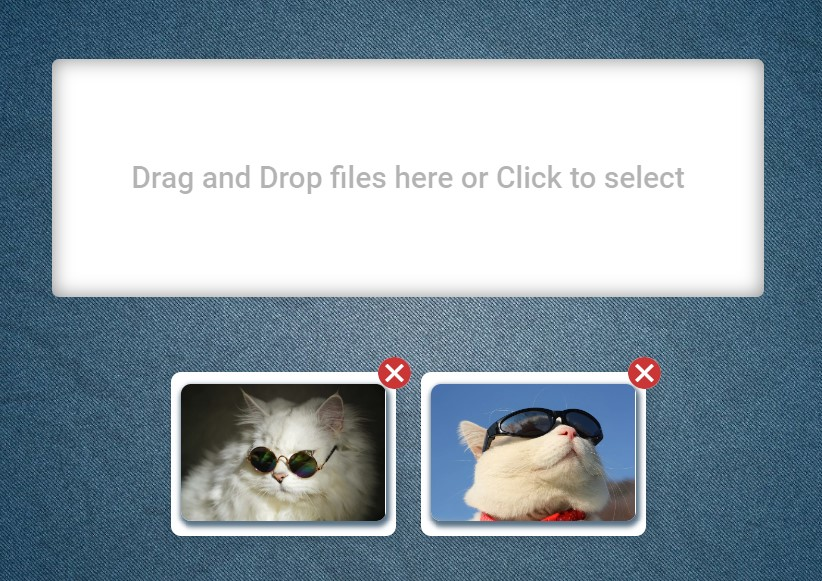

[GitHub Pages](https://lekseff.github.io/Modern-Image-Manager/)

### Modern Image Manager

Позволят добавлять изображение перетаскиванием с компьютера в поле DnD. При клике на поле открывается стандартное окно выбора файлов.

