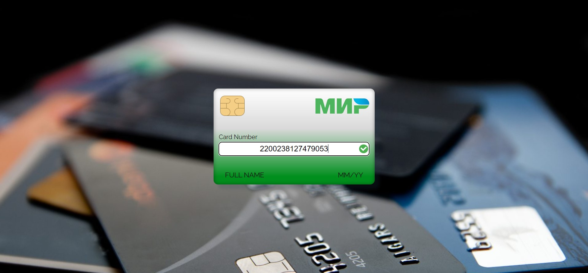
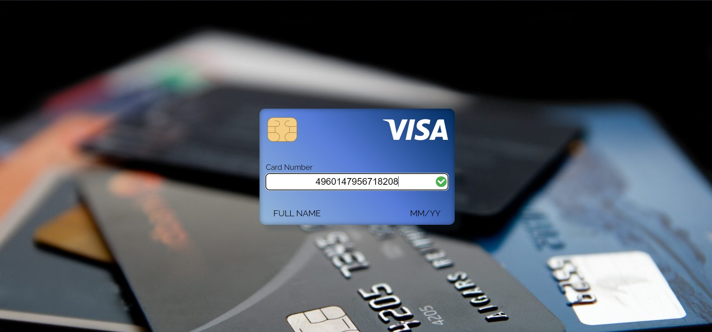
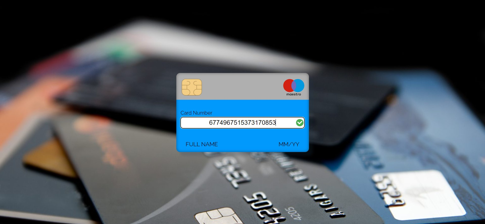
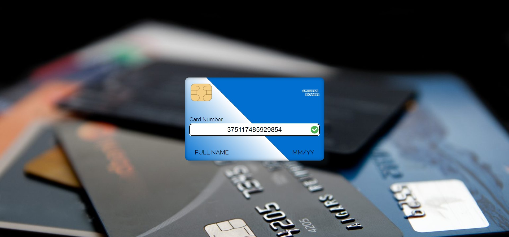

[GitHub Pages](https://lekseff.github.io/AHJ_4_1/)

### Credit Card Validator

Проверка карт на к определенной платежной системе. Доступна проверка карт Мир, Visa, Maestro, MasterCard, UnionPay, Discover, JCB, Dinners, American Express.

Также проверяется корректность номера карты по алгоритму Луна.

Пример карты МИР:

Пример карты VISA:

Пример карты MAESTRO:

Пример карты UNIONPAY:

Пример карты JCB:

Пример карты DISCOVER:

Пример карты DINERS:

Пример карты AMERICAN EXPRESS:
