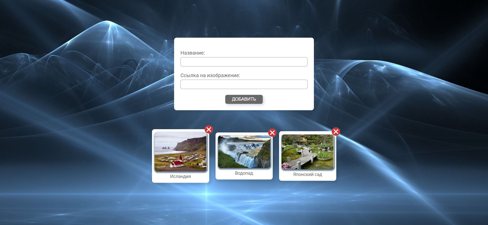

[GitHub Pages](https://lekseff.github.io/AHJ_3-3/)

### Галерея изображений с проверкой URL

#### Описание

Функциональность:

1. Добавлять можно как по кнопке "Добавить" так и по клавише Enter.
2. Если URL картинки валидный (т.е. там есть картинка) происходит добавление картинки.
3. Если URL картинки не валидный, изображение не добавляется,под полем "Ссылка на изображение" появляется сообщение об ошибке.
4. После добавления поле очищается.
