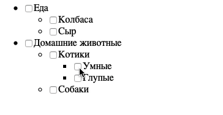

# Дерево интересов

## Описание 

Необходимо написать удобное управление списком интересов для профиля пользователя.

### Исходные данные

1. Основная HTML-разметка
2. Базовая CSS-разметка

### Процесс реализации

1. Реализуйте функционал, когда при клике на галочку будут проставляться/сниматься
галочки вложенных списков
2. В этом варианте задаче списки имеют максимум 1 уровень вложенности, поэтому
не нужно делать максимально общее и абстрактное решение.

### Повышенный уровень сложности (не обязательно)

Необходимо добавить функционал:

1. Простановка интересов должна работать на неограниченный уровень вложенности
2. Простановка галочек должна производиться как вниз, так и вверх по дереву
(если выбраны все дочерние элементы, нужно ставить галочку; иначе снимать)
3. Для дочерних элементов, если выбраны не все галочки, у родителя должно
устанавливаться значение *indeterminate*.

