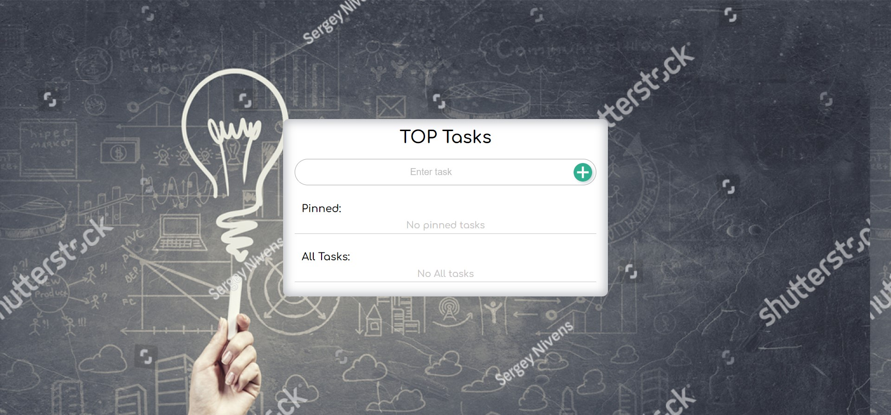

### Список задач

Пользователь может фильтровать и добавлять задачи с помощью поля ввода. Некоторые задачи можно закреплять ("pin").

#### Описание

1. Добавлять задачи можно при следующих условиях: в поле ввода есть текст и пользователь нажал "Enter" (если текста нет, но пользователь всё равно нажал "Enter" выводится сообщение об ошибке).
1. При добавлении задачи, задача добавляется в блок "All Tasks", а поле ввода очищается.
1. Когда закреплённых задач нет, в блоке "Pinned" должен отображаться текст "No pinned tasks".
1. Когда закреплённые задачи есть, они отображаются в блоке "Pinned" и не участвуют в процедуре фильтрации:
    * их отображение никак не зависит от состояния фильтра
    * они не отображаются в блоке "All Tasks"
1. При пустом поле ввода в блоке "All Tasks" отображаются все задачи с учётом условий предыдущего пункта (т.е. все, кроме "Pinned").
1. При изменении поля ввода содержимое блока "All Tasks" автоматически пересчитывается - отображаются только те задачи, название которых начинается с того, что введено в поле ввода (без учёта регистра).
1. Если значению поля ввода не удовлетворяет ни одна из задач, то в блоке "All Tasks" отображается текст "No tasks found".
2. При нажатии на звездочку задача из блока "All Tasks" попадает в "Pinned".

